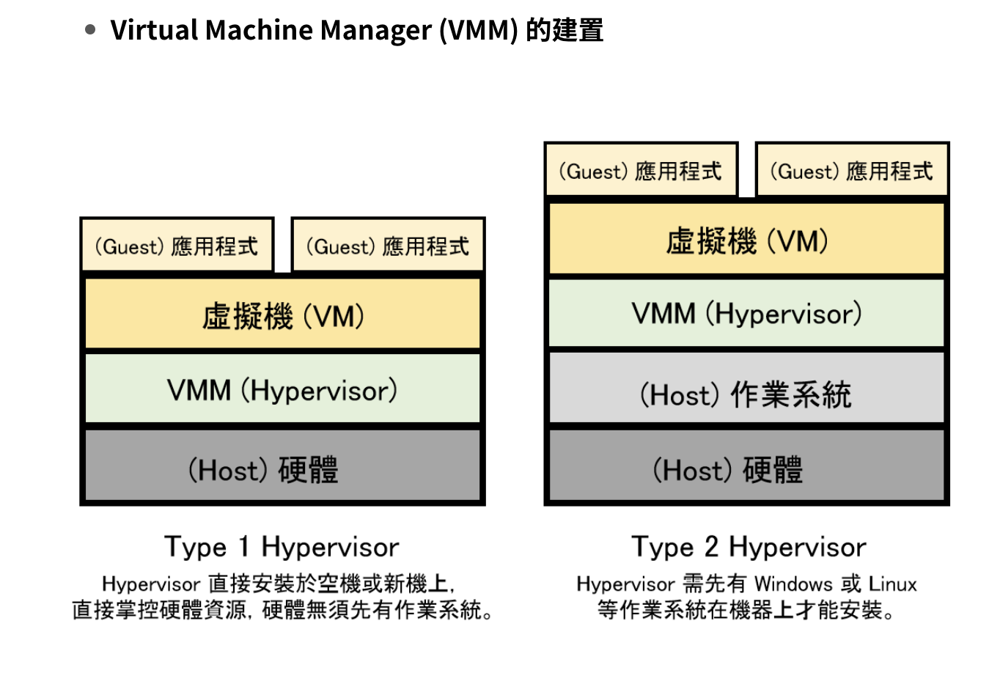

# Born2beroot

## Notes about the project
> System: Linux-Debian@12.1.0

#### User group setting

將 `USER_NAME` 加入 sudo 群組
```sh
usermod -aG sudo <USER_NAME>
```

確認有哪些 user 在 sudo 群組中
```sh
getent group sudo
```

編輯 sudoers 文件，該文件包含了 sudo 命令的設置和權限信息
```sh
sudo visudo
```

用戶可以以任何用戶身份（ALL）和在任何主機上（ALL）執行任何命令（ALL）
這樣的配置可以用於給特定用戶授予完整的 sudo 權限，使該用戶可以執行系統上的任何操作。
```
<USER_NAME>    ALL=(ALL) ALL
```

#### SSH service

> Requirement 
>> A SSH service will be running on port 4242 only. For security reasons, it must not be possible to connect using SSH as root.

安裝並確認 ssh service 狀態
```sh
sudo apt install openssh-server
sudo systemctl status ssh
```

重啟 ssh service
```sh
service ssh restart
```

PermitRootLogin：這是一個 SSH 伺服器的設定項，它規定是否允許 root 用戶通過 SSH 登錄到系統。

prohibit-password：這是 PermitRootLogin 的一個可能的值之一。prohibit-password 表示 root 用戶可以使用密碼（password）方式進行登錄，但這種方式在安全性上不推薦，因為可能會受到密碼猜測攻擊。

no：這是將 PermitRootLogin 設置為的新值。no 表示禁止 root 用戶通過 SSH 使用任何方式（包括密碼和密鑰）登錄系統。

所以，這個設定的作用是將 SSH 伺服器的 PermitRootLogin 設置從允許 root 用戶以密碼登錄改為不允許 root 用戶進行 SSH 登錄。這樣一來，root 用戶就不能直接通過 SSH 連接到系統，這是系統安全性的一個良好實踐，因為通常建議使用普通用戶登錄，然後再使用 sudo 或其他特權升級方式來執行特權操作
```sh
sudo vim /etc/ssh/sshd_config
===
1. 將 ssh port 改為 4242
#Port 22 -> Port 4242
2. root 不允許以任何形式登入
#PermitRootLogin prohibit-password -> PermitRootLogin no
```

#### Firewall setting

> Requirement
>> You have to configure your operating system with the UFW firewall and thus leave only port 4242 open.

安裝並啟用防火牆
```sh
apt-get install ufw
sudo ufw enable
```

顯示當前 UFW 防火牆的規則，並按照編號的方式列出。每條規則都有一個編號，你可以使用這些編號來刪除特定的規則或者做其他相關的操作。
```sh
sudo ufw status numbered
sudo ufw delete
```

允許使用 ssh access with 4242 port
```sh
sudo ufw allow ssh
sudo ufw allow 4242
```

#### Password policy

> Requirement
>> You have to implement a strong password policy
>>> * Your password has to expire every 30 days. 
>>> * The minimum number of days allowed before the modification of a password will be set to 2.
>>> * The user has to receive a warning message 7 days before their password expires.
>>> * Your password must be at least 10 characters long. It must contain an uppercase letter, a lowercase letter, and a number. Also, it must not contain more than 3 consecutive identical characters.
>>> * The password must not include the name of the user.
>>> * The following rule does not apply to the root password: The password must have at least 7 characters that are not part of the former password.
>>> * Of course, your root password has to comply with this policy.

安裝套件包
```sh
sudo apt-get install libpam-pwquality
```

- 基本密碼規則設定
    1. `pam_unix.so` 模組，它是用於進行基本的 UNIX 密碼驗證
    2. [success=2 default=ignore]：這是控制流程的條件控制，表示如果這個模組返回成功，則跳過下面兩個模組，否則繼續進行後續驗證
    3. obscure：這個選項要求密碼必須包含非字母數字符號，增強密碼安全性
    4. sha512：指定使用 SHA-512 作為密碼的雜湊算法
    5. minlen=10：這個選項要求密碼的最小長度為 10 個字符
    6. requisite：這個選項指定了此模組的必要性，如果這個模組返回失敗，則不再進行後續的密碼驗證，並立即拒絕更改密碼
    7. pam_pwquality.so：用於進行密碼規則的檢查和安全性設置
    8. retry=3：這個選項指定在密碼不符合規則時的重試次數
    9. lcredit=-1：要求密碼中至少包含一個小寫字母
    10. ucredit=-1：要求密碼中至少包含一個大寫字母
    11. dcredit=-1：要求密碼中至少包含一個數字
    12. maxrepeat=3：限制密碼中字符的最大重複次數
    13. usercheck=0：禁用用戶名與密碼相似性的檢查
    14. difok=7：設定至少有 7 個字符與上一個密碼不同
    15. enforce_for_root：強制 root 用戶也遵循這些規則
```sh
sudo vim /etc/pam.d/common-password
===
> password [success=2 default=ignore] pam_unix.so obscure - sha512 minlen=10
> password    requisite         pam_pwquality.so retry=3 lcredit =-1 ucredit=-1 dcredit=-1 maxrepeat=3 usercheck=0 difok=7 enforce_for_root
```

密碼時效設定
```sh
sudo vim /etc/login.defs
===
PASS_MAX_DAYS 30
PASS_MIN_DAYS 2
PASS_WARN_AGE 7
```

```sh
sudo reboot
```

##### Create user and assign into group
新增群組
```sh
sudo groupadd <GROUP_NAME>
```

列出所有用戶
```sh
sudo cut -d: -f1 /etc/passwd
```

新增用戶
```sh
sudo adduser <USER_NAME>
```

刪除用戶
```sh
sudo userdel <USER_NAME>
```

將用戶加入對應群組
```sh
sudo usermod -aG <GROUP_NAME> <USER_NAME>
```

將用戶移出對應群組
```sh
sudo deluser <USER_NAME> <GROUP_NAME>
```

確認用戶使否在群組中
```sh
getent group <GROUP_NAME>
```

列出所有群組
```sh
groups
```

顯示特定用戶的帳戶資訊，包括密碼的更改情況、密碼過期日期等
```sh
chage -l <USER_NAME>
```

##### Configuring sudoers group

> Requriement
>> * Authentication using sudo has to be limited to 3 attempts in the event of an incorrect password.
>> * A custom message of your choice has to be displayed if an error due to a wrong
password occurs when using sudo.
>> * Each action using sudo has to be archived, both inputs and outputs. The log file
has to be saved in the /var/log/sudo/ folder.
>> * The TTY mode has to be enabled for security reasons.
>> * For security reasons too, the paths that can be used by sudo must be restricted.
>>> Example:
/usr/local/sbin:/usr/local/bin:/usr/sbin:/usr/bin:/sbin:/bin:/snap/bin

```sh
sudo vim /etc/sudoers
===
1. 新增密碼輸入錯誤時的提示訊息
Defaults     badpass_message="Password is wrong, please try again!"

2. 將 sudo command 相關紀錄紀錄在指定檔案位置
Defaults	logfile="/var/log/sudo/sudo.log"
Defaults	log_input,log_output

3. 指定在使用 sudo 命令時必須在真實的控制台（tty）環境下執行，而不能在非交互式的環境下執行，這樣設定的好處包括：
    - 安全性提高：
        在真實的控制台環境下執行 sudo 命令可以避免非授權的程序或腳本以非交互式的方式執行 sudo，從而提高安全性。
    - 限制特權使用：
        該設定確保只有實際物理上位於系統的用戶可以執行擁有特權的操作，限制了特權操作的使用範圍。
    - 避免遠程攻擊：
        阻止在遠程或非交互式會話中執行 sudo，這樣可以避免潛在的遠程攻擊或自動化攻擊。
    - 降低潛在風險：
        當特權操作需要進行敏感的操作時，確保這些操作是由實際操作系統的人員執行，而不是由自動化程序執行。
Defaults        requiretty

4. 限制 sudo 命令在特權模式下可執行的程序的搜索路徑
- 控制可執行程序的路徑：
    限制了 sudo 命令在特權模式下可以執行的程序，僅限於指定的安全路徑內。這樣可以防止非法程序或惡意腳本被執行。
- 降低系統風險：
    限制了系統上可以執行的特權程序，減少了系統被攻擊的風險，特別是針對擁有特權的命令進行非授權執行的風險。
- 防止 Path 環境變數被劫持：
    避免了恶意攻击者通過修改 PATH 環境變數來導致 sudo 命令執行不安全程序或惡意程序的情況。
Defaults   secure_path="/usr/local/sbin:/usr/local/bin:/usr/sbin:/usr/bin:/sbin:/bin:/snap/bin"
```

##### Hostname setting

> Requirement
>> The hostname of your virtual machine must be your login ending with 42 You will have to modify this hostname during your evaluation.

顯示該主機狀態
```shell
hostnamectl
```

如何完整變更 hostname
```shell
hostnamectl set-hostname <NEW_HOSTNAME>

or

sudo vim /etc/hostname
```

```
sudo vim /etc/hosts
===
127.0.0.1       localhost
127.0.0.1       <NEW_HOSTNAME>
```

Need to reboot to apply the setting

##### Crontab configuration

安裝 netstat tools
```sh
sudo apt-get install -y net-tools
```

Place `monitoring.sh` in /usr/local/bin/
```bash
```

允許特定用戶在不需要密碼的情況下以特權執行 /usr/local/bin monitoring.sh 
```sh
sudo visudo
<USER_NAME> ALL=(ALL) NOPASSWD: /usr/local/bin/monitoring.sh
```

編輯 root 用戶的 crontab（定時任務表）
```sh
sudo crontab -u root -e
===
*/10 * * * * /usr/local/bin/monitoring.sh
```

----
## Evaluation

0. VM 實現原理
> Type 1: bARE-METAL Hypervisor (裸機 HYPERVISOR)
>> - 原理：此 VMM 運行在作業系統的 Kernel Mode。也就是做一個跟作業系統一模一樣的軟體服務，VMM 直接安裝於空機或新機上，
直接掌控硬體資源，硬體無須先有作業系統，這也是它被稱為「裸機」的原因。
>> - 特點：需要硬體支持、VMM 直接作為主作業系統、運行效率高。
>> - 產品：包括市面上的 VMware ESX、Joyent SmartOS、Critix XenServer

> Type 2: hosted Hypervisor
>> - 原理：此 VMM 運行在作業系統的 User Mode，也就是 VMM 運行在傳統的作業系統上、就像其他電腦程式。VMM 需先有 Windows 或 Linux  等作業系統在機器上才能安裝。

>> - 特點：VMM 作為應用程式運行在主作業系統環境內，運行效率一般較 Type 1 還低。

>> - 產品：包括市面上的 VMware Workstation、 VMware Fusion、Parallel Desktop、Oracle Virtual Box 等。



1. Debian v.s. CentOS 差異

- 發行商和基礎:
CentOS: 由CentOS專案開發，以Red Hat Enterprise Linux（RHEL）為基礎，CentOS是基於RHEL的開源版本，提供了相同的穩定性和可靠性。
Debian: 由Debian專案開發，以Debian GNU/Linux作為基礎，以自由軟體和開放原始碼的價值為基礎，強調自由軟體的使用。
- 套件管理系統:
CentOS: 使用RPM（Red Hat Package Manager）套件管理系統，通過yum（Yellowdog Updater, Modified）進行套件管理。
Debian: 使用APT（Advanced Package Tool）套件管理系統，通過apt-get或apt進行套件管理。
- 套件格式:
CentOS: 使用RPM套件格式，套件文件的副檔名為.rpm。
Debian: 使用DEB套件格式，套件文件的副檔名為.deb。
- 更新和穩定性:
CentOS: 較為保守，以提供穩定性為主要目標，較晚提供新套件版本。
Debian: 也較為穩定，並提供不同的發行版本，包括穩定版、測試版和不穩定版，用戶可以根據需求選擇版本。
- 社群和支援:
CentOS: 有一個龐大的社群和廣泛的企業支援，特別是對於企業環境非常受歡迎。
Debian: 也有一個活躍的社群，強調自由軟體的價值觀，並提供廣泛的支援。
文件結構和佈局:
> CentOS和Debian在文件系統結構和基本佈局上有些許不同，這包括系統配置文件的位置、服務啟動文件的位置等。
選擇使用CentOS或Debian取決於你的需求和個人偏好。如果你需要更保守和穩定的系統，可能會選擇CentOS。如果你偏好自由軟體的價值觀或需要使用APT系統，可能會選擇Debian。

2. 

> - 資源最佳化：
    多任務運行: 虛擬機器允許在同一台物理機上運行多個虛擬機器，以充分利用硬體資源，提高資源的利用效率。
> - 節省硬體成本: 透過共享實體硬體，可以在不購買額外硬體的情況下運行多個虛擬機器。
環境隔離和相容性：
> - 應用隔離: 每個虛擬機器是獨立的環境，使得應用程式在其中運行時互不影響，提高了系統的穩定性和安全性。
> - 相容性: 虛擬機器允許在同一台實體機器上運行不同作業系統，這對於開發、測試和相容性測試非常有用。
系統備份和恢復：
> - 易於備份: 虛擬機器可以通過備份虛擬機的狀態和配置來實現系統備份，並且可以輕鬆恢復到先前的狀態。
> - 減少停機時間: 使用虛擬機器，可以快速恢復運行，降低因系統故障而造成的停機時間。
> - 開發和測試環境：
>> - 多平台支援: 開發人員可以在單一物理計算機上運行多個虛擬機器，以測試應用程式在不同作業系統上的運行情況。
>> - 隔離環境: 虛擬機器提供一個獨立的測試和開發環境，不影響實際生產系統。
>>> 總的來說，虛擬機器提供了更有效率、靈活且成本效益高的方式，讓單一物理計算機可以運行多個獨立的運行環境，這些環境可以獨立運行並模擬獨立的硬體和作業系統。

3. the difference between aptitude and apt, and what APPArmor

> - aptitude 和 apt 的區別：
>   - aptitude：aptitude 是一個先進的套件管理前端工具，具有用戶友好的介面。它不僅可以安裝、更新和刪除套件，還可以做到解決依賴問題、查看套件資訊等。它更像是一個功能更豐富、複雜的工具，適用於用戶希望有高級操作和多功能的套件管理。
>   - apt：apt 是一個簡單、直觀的套件管理命令行工具。它是 Advanced Package Tool 的縮寫，是 Debian 和 Ubuntu 等基於 Debian 的發行版的標準套件管理工具。apt 提供了一組基本的命令，如安裝、更新、卸載套件等，使套件管理更簡單和容易理解。
> - AppArmor（Application Armor）：
AppArmor 是一種用於 Linux 的強制性訪問控制（MAC）系統，用於保護系統免受軟體漏洞或惡意軟體的攻擊。它基於安全策略，限制了應用程式的能力，只允許其訪問經過授權的資源。
透過配置規則，AppArmor 可以限制應用程式能夠進行的操作，如文件或目錄的讀取、寫入，網路通訊等。這有助於減少應用程式可能造成的損害，提高系統的安全性。
使用 AppArmor，系統管理員可以定義應用程式的存取控制規則，以確保應用程式運行在受控的環境中，並降低遭受安全威脅的風險。

4. Check that the UFW service is started
```sh
sudo ufw status numbered
```

5. Check that the SSH service is started 
```sh
sudo service sshd status
```

6. Check that the chosen operating system
```sh
uname -a
```

7. Check that it has been added and that it belongs to the
"sudo" and "user42" groups

```sh
getent group user42
getent group sudo
```

8. 如何完整變更 hostname
```shell
hostnamectl set-hostname <NEW_HOSTNAME>
sudo reboot
===
hostnamectl
```

9. 查看 partitions 狀態
```sh
lsblk
```

10. the disadvantages of the password policy

> - 密碼忘記和重置困難：
高複雜度的密碼容易被使用者遺忘，導致密碼重置過程變得繁瑣，增加了系統管理的負擔。
> - 密碼重複使用和記錄問題：
嚴格的密碼策略可能導致使用者傾向於重複使用相似的密碼，或者他們可能會在易於找到的地方記錄密碼，降低了安全性

---- 

## Commands notes

**`getent`**

```sh
getent [database] [name]
```

database：要查詢的名字服務數據庫，如 passwd、group、hosts 等。
name：要查詢的名稱，如用戶名、組名、主機名等

**`systemctl`**


systemctl 是一個用於控制 systemd 系統和服務管理器的命令行工具
```sh
sudo systemctl [start|stop|restart|status|enable|disable|show] service_name
```

**`wall`**

（write to all）是一個用於向系統中的所有用戶發送消息的命令。它可以用來向所有已登錄的用戶發送通知、警告或消息。

wall 指令後接要發送的消息，然後按 Ctrl + D 保存並發送消息。
所有當前登錄的用戶將收到你發送的消息。

**例子**
假設你想向所有用戶發送一條消息：

```sh
wall "系統將於10分鐘後重啟，請儘快保存工作並退出。"
```

這條消息將被發送到所有當前登錄的用戶，提醒他們系統將在10分鐘後重啟。

請注意，wall 命令需要有足夠的權限才能發送消息。通常，只有系統管理員或具有特定權限的用戶可以使用 wall 命令。


